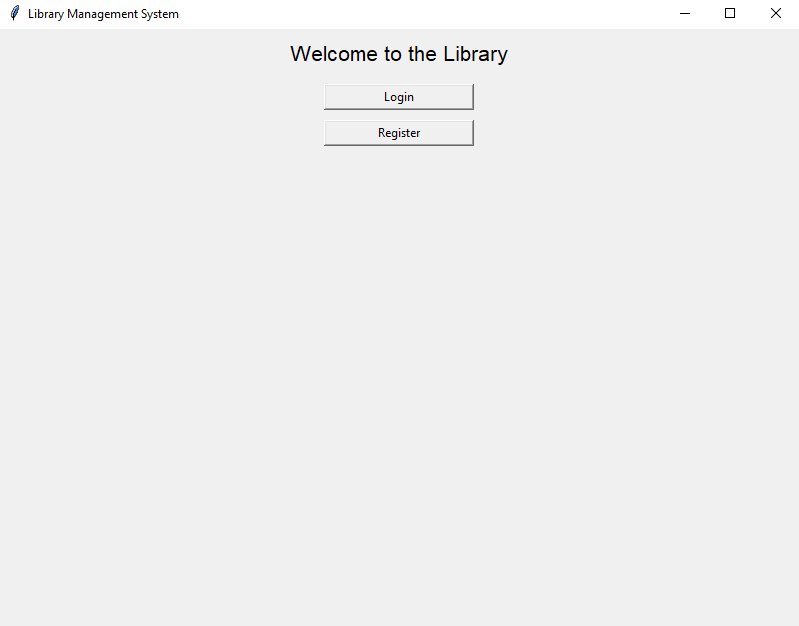

Library Management System

The Library Management System is a Python-based project designed to manage library operations efficiently. It provides features such as book management, user management, and dynamic searching using advanced programming paradigms like the Strategy and Iterator design patterns.

Features

General Features

User-friendly graphical interface (built with tkinter).

Dynamic and interactive searching for books.

Borrowing and returning books.

Waiting list management for borrowed books.

Notifications for waiting list clients.

Book Management

Add, remove, or edit books in the library.

Categorized views (e.g., by title, author, genre).

Support for "Available books," "Loaned books," and "Books by category" views.

User Management

User login and registration.

Authentication and authorization for library features.

Notifications

Notify users (via console output or placeholders for SMS and email services) when books become available.

Supports multiple communication channels.

Design Patterns Used

1. Strategy Pattern

Purpose: Enables dynamic search functionality for books.

Usage:

SearchByTitle, SearchByAuthor, and SearchByCategory implement the SearchStrategy interface to provide modular and extensible searching functionality.

2. Iterator Pattern

Purpose: Allows traversal of books grouped by categories.

Usage: BookCategoryIterator provides an easy way to iterate over books grouped by their genre, used in the "By Category" view.

3. Observer Pattern

Purpose: Manages notifications for waiting list clients.

Usage:

The NotificationService class implements the observer pattern by maintaining a list of observers (EmailNotifier, SMSNotifier) and notifying them when a book becomes available.

This decouples the notification mechanism from the core library logic, making it extensible for additional notification methods.

Functionalities

Login/Register:

Login: Existing users can log in using their username and password.

Register: New users can create an account by providing a username and password.

Main Menu:

Access all library features after successful login.

Options include:

Add Book: Add a new book to the library by specifying title, author, genre, year, and number of copies.

Remove Book: Remove an existing book from the library by searching for it.

View Books: Display books in different views:

All Books: Lists all books in the library.

Available Books: Lists books with available copies.

Loaned Books: Lists books that are fully loaned out.

By Category: Displays books grouped by genre.

Search Book: Search for books by title, author, or genre with dynamic suggestions.

Lend Book: Borrow a book if it is available.

Return Book: Return a borrowed book and notify the next client on the waiting list (if any).

Popular Books: View the top 5 most popular books based on loan and waiting list metrics.

Dynamic Search:

Start typing in the search bar to see instant suggestions.

Suggestions update dynamically based on the selected search type (title, author, genre).

Notifications:

When a returned book becomes available, clients on the waiting list are notified via email and SMS (or placeholder console output).

Waiting List Management:

If a book is fully loaned out, users can join a waiting list.

When a copy becomes available, the next user on the waiting list is notified and removed from the list upon acknowledgment.

Example Screenshots

Login/Register Screen

Book View (By Category)

Acknowledgments

Developed as part of a Python programming course.

Inspired by real-world library management challenges.

